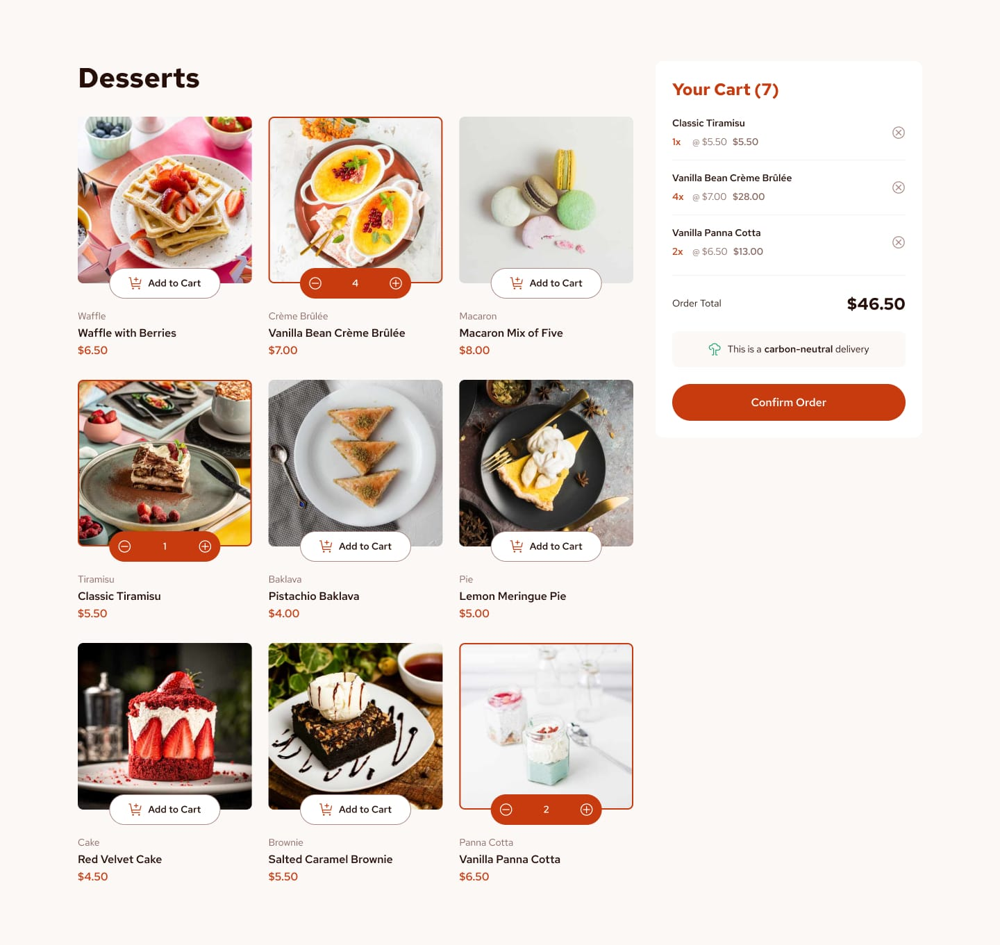

# Frontend Mentor - Product list with cart solution

This is a solution to the [Product list with cart challenge on Frontend Mentor](https://www.frontendmentor.io/challenges/product-list-with-cart-5MmqLVAp_d).

## Overview

### The challenge

Users should be able to:

- Add items to the cart and remove them
- Increase/decrease the number of items in the cart
- See an order confirmation modal when clicking "Confirm Order"
- Reset selections when clicking "Start New Order"
- View optimal responsive layout across mobile, tablet, and desktop screens
- Experience hover, focus, and active states for all interactive elements

### Screenshot

## Built with

- Semantic HTML5 markup
- CSS3 Custom Properties (Variables)
- CSS Grid & Flexbox layout techniques
- BEM (Block Element Modifier) methodology
- Mobile-first responsive workflow
- Vanilla JavaScript (DOM manipulation, Map state management, event delegation)
- Web Accessibility (ARIA attributes, semantic labels, keyboard navigation)

## Author

- Frontend Mentor - [Beso Ezugbaia](https://www.frontendmentor.io)
- GitHub - [besoezugbaia-ctrl](https://github.com/besoezugbaia-ctrl)
